# WhaleEcho

---
WhaleEcho is websocket server for handling websocket connection in whale.

## Installation

1. Use the go module to get install this project

```bash
go get github.com/whale-team/whaleEcho
```

2. Setup Environment

```bash
make env.setup
```

3. Run the test

```bash
make run.test.all
```

### System Design

#### System Flow  



#### Component Diagram

